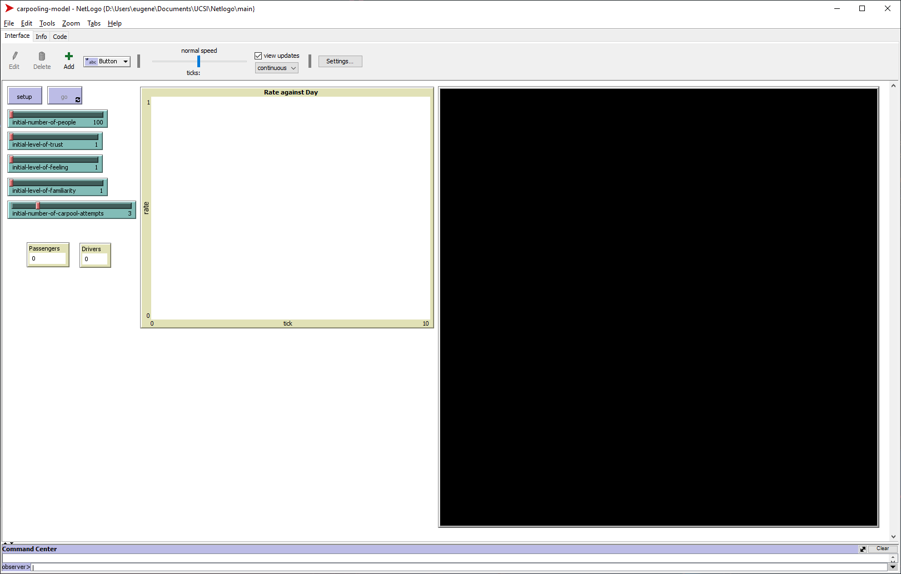
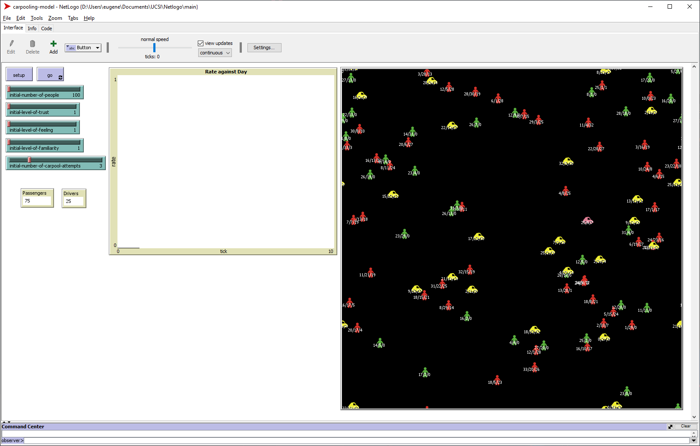

# Agent-Based Modelling on Carpooling Based on Interpersonal Proximity and Perception
In this simulation, the model can be used to understand the interaction between interpersonal proximity and perception to carpooling.

# Usage
A daily based scenario will be create in this simulation, commuters will offer for carpooling everyday morning. The success rate of carpooling is based on the level of interpersonal proximity and perception among each commuter. The result for the simulation is show the rate of success carpool in daily. These are the following assumptions for this simulation:

<ol>
 <li>25% of commuters will auto assign as a driver, and 75% will auto assign as a passenger. Each driver can carpool with 3 passenger.</li>
 <li>Only drivers are allow to offer for a carpool, and the offer will limited with 3 success per day.</li>
 <li>Level of interpersonal proximity and perception will be measure in percentage, and the range will be defined as: high(68-100)%, mid(34-67)% and low (0-33)%.</li>
 <li>There will be few variables of interpersonal proximity and perception, but each commuters will only be assign with only one variable. Each variable will indicate in different colour.</li>
 <li>The percentage of the level of interpersonal proximity and perception will be assign randomly according to the range to all commuters, the percentage will only appear in the form of integers.</li>
 </ol>
 
# Variables
Both driver and passenger are the agent in this agent-based modelling, and the variable to define the agent are the variable of interpersonal proximity and perception. The variable are:
<ol>
 <li>Level of Trust</li>
 <li>Level of Feeling</li>
 <li>Level of Familiarity</li>
</ol>

The amount of the variables are adjustable by user in percentage form with capped of 100% in this simulation. For example, user can set 10% for Level of Trust, 70% Level of Feeling and 20% Level of Familiarity in this simulation.

# Setup
In the setup process, user can insert the initial number of total commuters. Then user can select the range of each Level of variables. User can select multiple setting of the range of Level. For example, if user select low and mid together, the range will then become (0-67)%, if user didn’t select anything, the range will become 0%. Next, user need to select the number of time that driver ask for a carpool from passengers. The option are from (1 to 10) time(s). Lastly, percentage of good experience ride is also allow to set up as an initial setting by the user.

During the run of simulation, the process is define as:
<ol>
 <li>The success rate of carpool is based on percentage. If Level of variables (%driver+%passenger)/2 are equal or more than 50%, this indicate a success carpool.</li>
 <li>This modelling are capable with evolution.</li>
 <li>Evolution will only affect the Level of each variables accordingly and it bring forward and update daily in the simulation.</li>
 <li>When a carpool is success, both driver and passenger, the level of Trust and Familiarity will increase by 1%, if and only if they are assign with the variable of Trust or Familiarity.</li>
 <li>If a carpool is fail, the level of Trust and Familiarity will remain the same.</li>
 <li>The level of Feeling is different rating from above, if there is any success carpool, all commuters with variable of Feeling will increase the level by 1%, if any fail carpool, all commuters with variable of Feeling will decrease the level by 1%.</li>
 <li>When the carpool is success, there is another evolution come in, the good experience of ride.</li>
 <li>When there is a good experience of a success ride, the level of variable will increase by 1% for each commuters who experienced it.</li>
 <li>When there is bad experience ride, the level of Familiarity will decrease 1%, the level of Trust will decrease 2% and the level of Feeling will decrease 3% accordingly to each commuters who experienced it.</li>
 <li>The minimum level of variable is 0% and maximum is 100%.</li>
</ol>

# Output
Output of the simulation will be a graph of rate of success carpool again time. The rate of success define as number of commuters with success carpool over total commuters. The time is defined in day.

  
  &nbsp; &nbsp; &nbsp;
  
  &nbsp; &nbsp; &nbsp;
  

